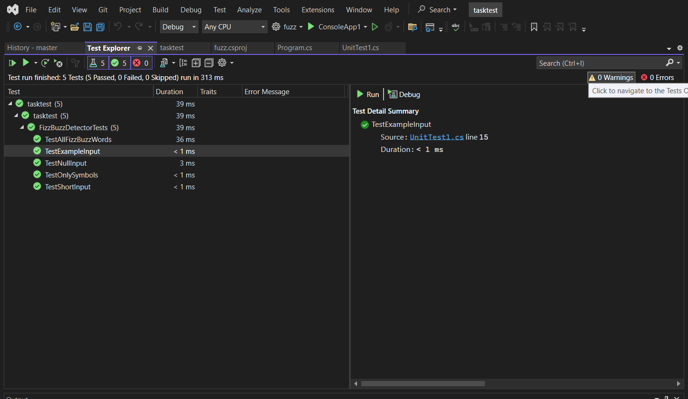

---
# FizzBuzz Detector

The **FizzBuzz Detector** is a simple application that processes an input string and replaces words based on the FizzBuzz logic. Words in the string are replaced with `Fizz`, `Buzz`, or `FizzBuzz` depending on their position in the sequence. 

## Table of Contents
- [Overview](#overview)
- [Getting Started](#getting-started)
- [How It Works](#how-it-works)
- [Code Explanation](#code-explanation)
- [Example Usage](#example-usage)

---

## Overview

The FizzBuzz problem is a classic programming challenge where you replace numbers with specific words based on divisibility. This detector extends that logic to process an input string of words, replacing the words at certain positions based on divisibility rules.

**FizzBuzz rules**:
- Numbers divisible by 3 are replaced with "Fizz".
- Numbers divisible by 5 are replaced with "Buzz".
- Numbers divisible by 15 are replaced with "FizzBuzz".

This application uses the same logic but applies it to words in an input string, starting at position 1.

---

## Getting Started

### Prerequisites

To run this application, you'll need the following installed:
- [.NET SDK](https://dotnet.microsoft.com/download) (version 6 or higher)

### Installation

1. Clone the repository:

   ```bash
   git clone https://github.com/ziad2001-lab/task-test.git
   cd fizzbuzz-detector
   ```

2. Build the project:

   ```bash
   dotnet build
   ```

3. Run the application:

   ```bash
   dotnet run
   ```

---

## How It Works

1. **Input Processing**:
   - The application accepts an input string that contains multiple words.
   - It handles line breaks and removes them by replacing newline characters (`\n`) with spaces.

2. **Word Extraction**:
   - The string is parsed into individual words, while keeping track of the starting index of each word. This is done using a helper function that identifies letters, digits, and apostrophes.

3. **FizzBuzz Logic**:
   - For each word in the string, the application checks its position (starting from 1).
   - If the position is divisible by 3, 5, or both, the word is replaced accordingly:
     - Divisible by 3: Replace with "Fizz".
     - Divisible by 5: Replace with "Buzz".
     - Divisible by 15: Replace with "FizzBuzz".

4. **Output**:
   - After applying the replacements, the processed string is returned along with the count of replacements made.

---

## Code Explanation

### FizzBuzzResult Class

The `FizzBuzzResult` class stores the results of the FizzBuzz processing:
- **OutputString**: The modified string with FizzBuzz replacements.
- **Count**: The number of words replaced by FizzBuzz logic.

### FizzBuzzDetector Class

The main logic of the application resides in the `FizzBuzzDetector` class. It contains the following methods:

- **GetOverlappings(string input)**: This method takes an input string, processes it by replacing words based on their position in the sequence, and returns a `FizzBuzzResult` object containing the modified string and the count of replacements.
  
- **ExtractWords(string input)**: Extracts all words from the input string and returns them with their starting index. This allows the program to modify the string accurately without losing track of word positions.
  
- **GetFizzBuzzReplacement(int position)**: Determines what replacement (if any) should be made for a given word based on its position:
  - Divisible by 3: "Fizz"
  - Divisible by 5: "Buzz"
  - Divisible by 15: "FizzBuzz"

---

## Example Usage

### Input:
```text
Mary had a little lamb
Little lamb, little lamb
Mary had a little lamb
It's fleece was white as snow
```

### Output:
```text
Mary had Fizz little Buzz
Fizz lamb, little Fizz
Buzz had Fizz little lamb
FizzBuzz fleece was Fizz as Buzz
```

### Code:
```csharp
string input = @"Mary had a little lamb
Little lamb, little lamb
Mary had a little lamb
It's fleece was white as snow";

FizzBuzzDetector detector = new FizzBuzzDetector();
FizzBuzzResult result = detector.GetOverlappings(input);

Console.WriteLine("Output string:");
Console.WriteLine(result.OutputString);
Console.WriteLine($"Count: {result.Count}");
```

### Explanation:
The above code demonstrates how to use the `FizzBuzzDetector` to process a string. It replaces words in the input text with "Fizz", "Buzz", or "FizzBuzz" based on their position and prints the result.

---

## ✅ Unit Test Results




